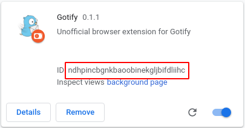
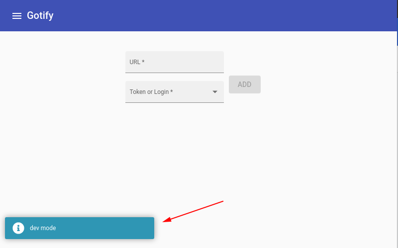
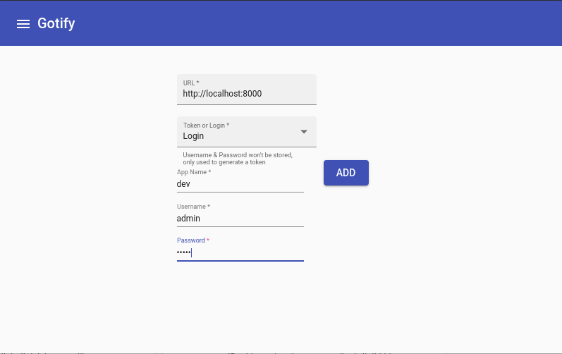

# Gotify Browser Extension

A browser extension for Gotify

## Support:

- Chrome

## Installation
You must configure your server CORS to allow the extension to make requests, like so:
In your config.yml
```
server:
  responseheaders: # response headers are added to every response (default: none)
    Access-Control-Allow-Origin: "chrome-extension://defcailckfpgaigaiijligpnjipkhhmg"
    Access-Control-Allow-Methods: "GET,POST,OPTIONS"
    Access-Control-Allow-Headers: "Authorization, content-type"
  stream:
    allowedorigins: # allowed origins for websocket connections (same origin is always allowed, default only same origin)
      - "defcailckfpgaigaiijligpnjipkhhmg"
```
Or, in your docker-compose.yml
```
environment:
        GOTIFY_SERVER_RESPONSEHEADERS: "Access-Control-Allow-Methods: \"GET,POST,OPTIONS\"\nAccess-Control-Allow-Origin: \"chrome-extension://defcailckfpgaigaiijligpnjipkhhmg\"\nAccess-Control-Allow-Headers: \"Authorization, content-type\""
        GOTIFY_SERVER_STREAM_ALLOWEDORIGINS: "- \"defcailckfpgaigaiijligpnjipkhhmg\""
```

More info can be found here: https://gotify.net/docs/config

## Development
Dependencies:

- Docker/docker-compose

First, run an initial build.

```shell script
cd gotify_dev && docker-compose up
```

You can `ctrl+c` out once the ng cli has finished building.

Next, navigate your browser to `chrome://extensions` and toggle `Developer mode` on.

Then, click `Load unpacked` and load up the `dist/gotify-ext` folder. (this will only work if you have run the initial build earlier)

Once the unpacked extension has successfully started, copy the extension id from here



Then, in `gotify_dev` copy and paste `example.env` as `.env` and assign `EXT_ID` with the value you've copied.

Fire up the docker stack like before with

```shell script
docker-compose up
```

If you have both the production Gotify extension and are developing, you can tell the difference as the development version has this little notification when you open the popup:



You can now add your local docker gotify server to your dev extension with a url of `http://localhost:8000`, and the username and password both being `admin`.



You should be all set. I recommend using the [Gotify cli](https://github.com/gotify/cli) to test pushing messages to your dev server.

Logo is from https://github.com/gotify/logo
